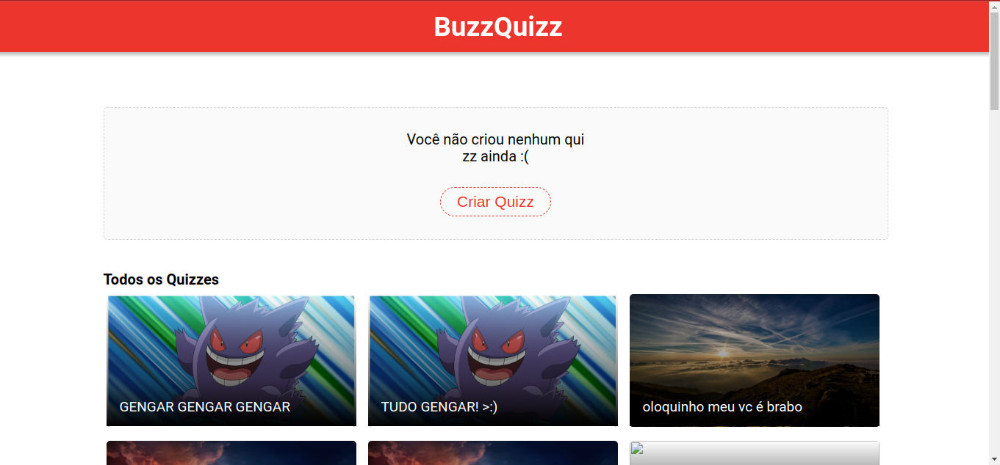
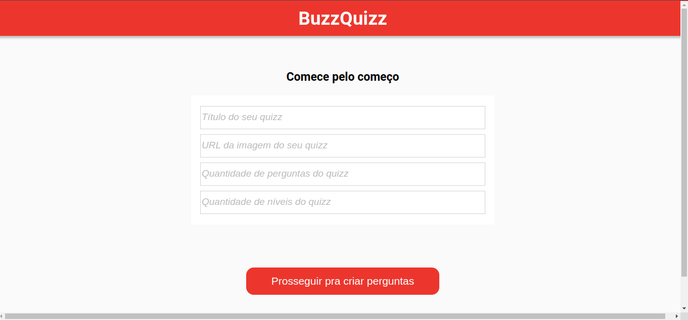
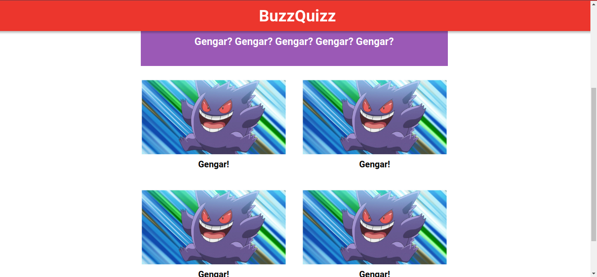

# Buzzquizz

## Descrição:
Esse projeto foi criado com Javascript, HTML e CSS, se o uso de bibliotecas ou frameworks como React ou Vue, além disso foi utilizada uma API de terceiros.
A sua funcionalidade é a de um site de criação e visualização de quizzes, o usuário pode criar um quizz com imagems em que há 4 opções para apenas uma resposta
correta, esse quizz é enviado para a APi e todos podem visualiza-lo, os quizzes criados pelo usuário ficam armazenados em uma aba especial na aplicação, e a
sessão é identificada através de local storage. Além disso o usuário pode responder os quizzes dos outros usuários.
O link do deploy da aplicação, realizado com o Vercell, encontra-se neste repositório.

# Buzzquizz

A site of quizzes, where you can create and answer quizzes with four options and just one correct answer. In this project i have used HTML, CSS, and Javascript to create the Front-end, wich was integrated with an provided API. Theuser-created quizzes are saved in a special tab, and the user can answer the other users quizzes.

Check out the [deploy](http://projeto-06-buzzquizz-orcin.vercel.app/)

